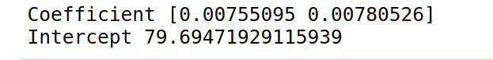

# Implementation of Multivariate Linear Regression
## Aim
To write a python program to implement multivariate linear regression and predict the output.
## Equipment’s required:
1.	Hardware – PCs
2.	Anaconda – Python 3.7 Installation / Moodle-Code Runner
## Algorithm:
### Step1
Import the pandas as pd

### Step2
From sklearn import the linear model.

### Step3
Read the file csv.

### Step4
Get the input from the user.

### Step5
Print the output.

## Program:
```
import pandas as pd
from sklearn import linear_model
df=pd.read_csv("car.csv")
x=df[["weight","volume"]]
y=df['co2']
regr=linear_model.linearregression()
regr.fit(x,y)
print("Coefficient",regr.coef_)
print("Intercept".regr.intercept_)
predictedco2=regr.predict([[3300,1300]])
print("predicted co@ for the coressponding weight and volume",predictedco2)
```
## Output:


## Result
Thus the multivariate linear regression is implemented and predicted the output using python program.